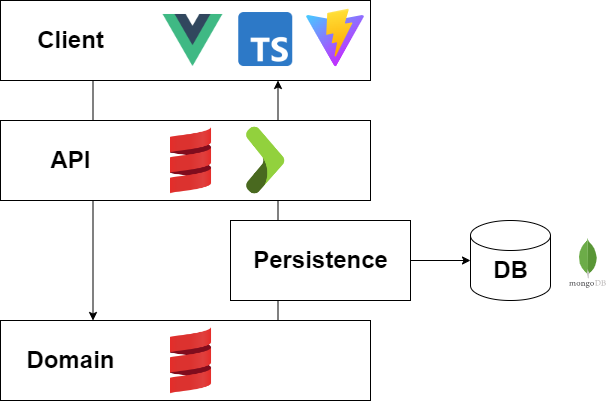

# Llama Land
A digital version of the board game Llama Land! This was created during the traineeship program of Sogyo where a trainee had to finish their own project in 3 weeks. To challenge myself I decided to try writing the entire stack in languages/frameworks I'm unfamiliar with such as Scala for the domain and the Vue framework for the front-end. 

# Description
Every player starts with a large starting piece (consisting of 4x4 tiles), every turn a player can take 1 piece and try to either place it next to another tile or place it on top of some tiles. When the player puts the piece on top of some tiles, they'll gain all the crops of the overlapped tiles. With 4 crops a player can buy a llama and place it on the board. The player with the most llama's wins! (not quite but there's not enough time to implement the point system)

# Installation
You need to have Scala, SBT and Node.js installed (From Scala 3.5.0 onwards, SBT is bundled with the installation) 
Before running the application install the Node.js packages by running the following commands

`cd client`
`npm install`

To start the api, run the following command in the root directory (the api will run on localhost:9000)

`sbt api/run`

To start the webapp, run the following command in the /client directory (the webapp will run on localhost:5173)

`npm run dev`

# Architecture
The application is built as a layered monolith. The front-end aka the client layer is developed in TypeScript using the Vue framework and built with Vite. The front-end then connects to the back-end through the API layer, which is developed in Scala using the Scala Play framework. The API controller then calls methods to the domain layer, which is purely developed in Scala with no frameworks. The API controller also calls method to the MongoDB database through the persistence layer, which is also developed in Scala.

# Requirements
Since it was a 3 week project I also had to set requirements, you can see which requirements I had down below. The requirements I managed to finish are marked.

**Must**
- A player can choose a piece based on a list of pieces ✔
- A player can place a tile next to another tile ✔
- A player can place a tile on top of another tile ✔
- A player can gain crops when placing a tile on top of a crop tile ✔
- A player can buy a llama and place it on the field ✔

**Should**
- A player can rotate the piece to place ✔
- A player can gain coins when placing a tile on top of a coin tile
- A player can trade two coins to gain a crop
- A player can place foundation tiles
- A player can play against another player ✔
- A point system to determine the winner

**Could**
- A player can flip the piece to place ✔
- A player can mark goals to gain extra points
- A player can get villagers that can assist them with gaining crops
- The board and tile art are drawn with pictures ✔

**Won’t**
- A player can mark special goals to gain extra points
- Players can play against each other online

# Technical and personal goals
The project had as goal to challenge yourself, so I decided to add the following goals.

**Technical goals**
- Making an entire backend with Scala and learning how to use the Play framework
- Learning how to use Vue

**Personal goals**
- Develop the domain using TDD

